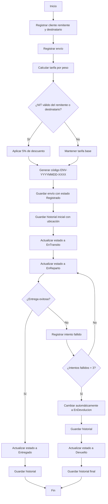

# Diagrama de flujo del proceso

Puede usarlo como referencia para dibujarlo en el cuadernillo.

```mermaid
flowchart TD
    A[Inicio] --> B[Registrar cliente remitente y destinatario]
    B --> C[Registrar envío]
    C --> D[Calcular tarifa por peso]
    D --> E{¿NIT válido del remitente o destinatario?}
    E -- Sí --> F[Aplicar 5% de descuento]
    E -- No --> G[Mantener tarifa base]
    F --> H[Generar código ENV-YYYYMMDD-XXXX]
    G --> H
    H --> I[Guardar envío con estado Registrado]
    I --> J[Guardar historial inicial con ubicación]
    J --> K[Actualizar estado a EnTransito]
    K --> L[Actualizar estado a EnReparto]
    L --> M{¿Entrega exitosa?}
    M -- Sí --> N[Actualizar estado a Entregado]
    N --> O[Guardar historial]
    O --> P[Fin]
    M -- No --> Q[Registrar intento fallido]
    Q --> R{¿Intentos fallidos = 3?}
    R -- No --> L
    R -- Sí --> S[Cambiar automáticamente a EnDevolucion]
    S --> T[Guardar historial]
    T --> U[Actualizar estado a Devuelto]
    U --> V[Guardar historial final]
    V --> P
```
