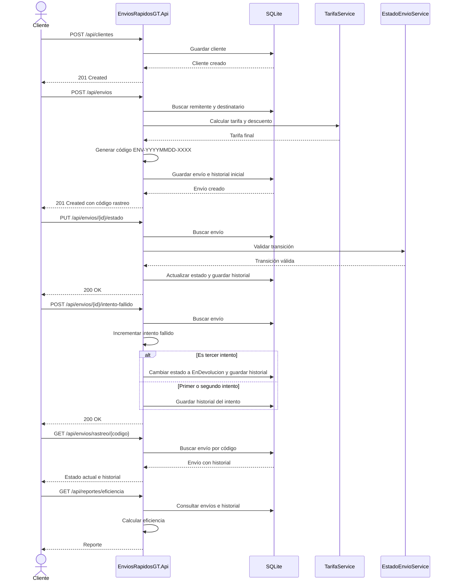

# Diagrama de secuencia

Puede pegar este diagrama en un visor de Mermaid para exportarlo como imagen.

```mermaid
sequenceDiagram
    actor Cliente
    participant API as EnviosRapidosGT.Api
    participant DB as SQLite
    participant Tarifa as TarifaService
    participant Estado as EstadoEnvioService

    Cliente->>API: POST /api/clientes
    API->>DB: Guardar cliente
    DB-->>API: Cliente creado
    API-->>Cliente: 201 Created

    Cliente->>API: POST /api/envios
    API->>DB: Buscar remitente y destinatario
    API->>Tarifa: Calcular tarifa y descuento
    Tarifa-->>API: Tarifa final
    API->>API: Generar código ENV-YYYYMMDD-XXXX
    API->>DB: Guardar envío e historial inicial
    DB-->>API: Envío creado
    API-->>Cliente: 201 Created con código rastreo

    Cliente->>API: PUT /api/envios/{id}/estado
    API->>DB: Buscar envío
    API->>Estado: Validar transición
    Estado-->>API: Transición válida
    API->>DB: Actualizar estado y guardar historial
    API-->>Cliente: 200 OK

    Cliente->>API: POST /api/envios/{id}/intento-fallido
    API->>DB: Buscar envío
    API->>API: Incrementar intento fallido
    alt Es tercer intento
        API->>DB: Cambiar estado a EnDevolucion y guardar historial
    else Primer o segundo intento
        API->>DB: Guardar historial del intento
    end
    API-->>Cliente: 200 OK

    Cliente->>API: GET /api/envios/rastreo/{codigo}
    API->>DB: Buscar envío por código
    DB-->>API: Envío con historial
    API-->>Cliente: Estado actual e historial

    Cliente->>API: GET /api/reportes/eficiencia
    API->>DB: Consultar envíos e historial
    API->>API: Calcular eficiencia
    API-->>Cliente: Reporte
```
